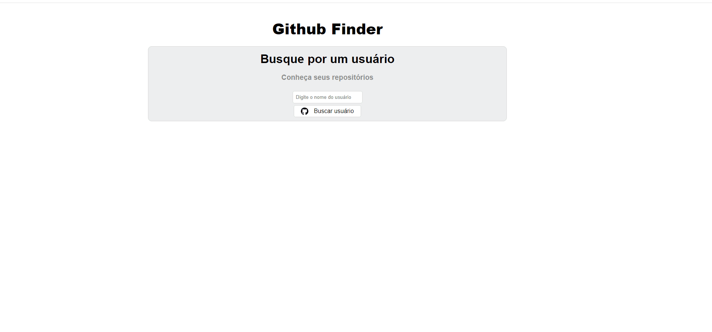

# GITHUB FINDER

## Preview do Projeto

### Versão Desktop

### Versão Responsiva

### 📃 Descrição 📃

- Objetivo

    - O objetivo deste projeto é facilitar a leitura dos dados dos usuários do github, apresentando dados, como: Nome, Localização, Tempo como usuário do Github, seus seguidores, todos os repositórios (projetos) ordenados pelo mais recente, etc.

- Propósito

    - O propósito deste projeto foi exclusivamente para desenvolver os meus estudos, praticando e concretizando os meus conhecimentos em React, Typescript e Sass. Além de conhecer novas ferramentas como: React-query, A biblioteca Date-fns, entre outras.

### 📉 Funcionalidades 📈

- Consultar usuários do github;
- Visitar o perfil do usuário do github;
- Visitar projetos específicos do usuário do github;
- Visitar sites do usuário do github (se tiver); 

### 🛠️ Tecnologias 🛠️

- REACT
- REACT QUERY
- DATE-FNS
- TYPESCRIPT
- SASS
- GIT
- GITHUB
- VSCODE

### 👨‍💻 Status do Projeto 👨‍💻

- Finalizado com Sucesso! ✔️

## 🛑 Não pare por aqui! 🛑

- Gostou do meu projeto? Então me acompanhe no LinkedIn, para ficar por dentro das minhas últimas aplicações! 😉

- [Linkedin](https://www.linkedin.com/in/thasyo-peres-63aa27235/)